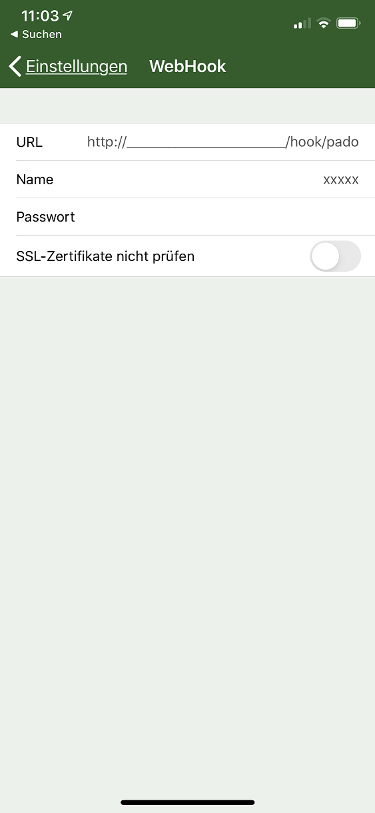
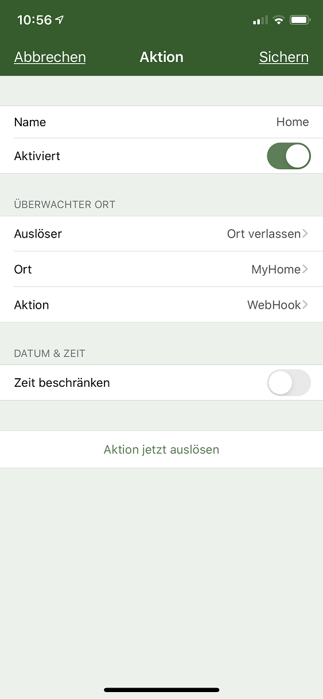

# Pado
Das Modul dient zum Empfangen von Geofencing Daten des Tools "Pado". Damit ist es möglich, das Verlassen und Betreten von Orten in IP-Symcon zu registrieren.

Das Modul ist aus dem Geofency Modul der Symcon GmbH entstanden. Meinen Dank an der Stelle für das freundliche zur Verfügung Stellen des Codes.
 
### Inhaltsverzeichnis

1. [Funktionsumfang](#1-funktionsumfang)
2. [Voraussetzungen](#2-voraussetzungen)
3. [Software-Installation](#3-software-installation)
4. [Pado Konfiguration](#4-pado-konfiguration)
5. [Einrichten der Instanzen in IP-Symcon](#5-einrichten-der-instanzen-in-ip-symcon)
6. [Statusvariablen und Profile](#6-statusvariablen-und-profile)
7. [WebFront](#7-webfront)
8. [PHP-Befehlsreferenz](#8-php-befehlsreferenz)

### 1. Funktionsumfang

* Pro Gerät eine eigene Standortliste
* Benutzername und Passwort Identifikation innerhalb von IP-Symcon.
* Richtet automatisch den Webhook "/hook/pado" ein.
* Es wird empfohlen dies in Kombination mit dem Connect Modul zu nutzen.
* Optional kann der aktuelle Standort von Pado übermittelt werden

### 2. Voraussetzungen

- IP-Symcon ab Version 5.3
- Pado App für Apple iOS

### 3. Software-Installation

* Über den Module Store das Modul Pado installieren.

### 4. Pado Konfiguration

Unter _Einstellungen -> Export -> WebHook_ sind die Verbindungsdaten zu IP-Symcon einzutragen.

- URL: Als URL wird die Domain eingetragen, unter der IP-Symcon zu erreichen ist, gefolgt von _/hook/pado_. Am einfachsten ist es, dort die IP-Symcon Connect Adresse einzutragen gefolgt von _/hook/pado_.

- Name: Der Webhook Benutzername, der dann in IP-Symcon hinterlegt wird

- Passwort: Das Webhook Passwort, das dann in IP-Symcon hinterlegt wird 

#### Aktion

Unter Aktionen ist mit + eine neue Aktion hinzuzufügen.

In der Aktion wird der Ort und die Aktion (Ort verlassen/Ort betreten) angegeben.

Als Aktion ist _WebHook_ auszuwählen. _Inhalt_ und _Post Parameter_ der WebHook Nachricht sollten beibehalten werden.

##### Inhalt
Die Nachricht kann leergelassen werden oder ein beliebiger Text mitgegeben werden. Als URL wird die in den Einstellungen angegebene Adresse vorgeblendet und kann übernommen werden.
_Parameter als JSON_ muss deaktiviert sein.

##### Post Parameter
Als Post Parameter sind mindestens die Variablen "name", "id" und "device" sowie "enter" oder "exit" zu aktivieren.

### 5. Einrichten der Instanzen in IP-Symcon

- Unter "Instanz hinzufügen" ist das 'Pado'-Modul unter dem Hersteller '(Kern)' aufgeführt.

__Konfigurationsseite__:

Name         | Beschreibung
------------ | ---------------------------------
Benutzername | Benutzername, welcher in der Pado App angegeben werden muss, um IP-Symcon Daten schicken zu können.
Passwort     | Passwort, welches in der Pado App angeben werden muss.

_Werden diese Daten Leer gelassen kann jeder über den Hook Daten an IP-Symcon schicken._

### 6. Statusvariablen und Profile

Die Statusvariablen/Kategorien werden automatisch angelegt. Das Löschen einzelner kann zu Fehlfunktionen führen.

##### Statusvariablen
Die Variablen werden anhand der Geräte ID und beim erstmaligen Senden innerhalb des Pado Moduls automatisch angelegt. Es können mehrere Geräte über einen Hook laufen. Jedes Gerät wird unter seiner eigenen "Kategorie" eingerichtet.

Name                    | Typ             | Beschreibung
----------------------- | --------------- | ----------------
Gerätename              | Instanz (Dummy) | Dient als "Kategorie" in der sich alle überwachten Standorte, sowie der Zeitstempel und Längen-/Breitengrad befinden. Wird pro Gerät erstellt.
Latitude                | Float           | Breitengrad (Mitte des Geofences) der letzten Aktivität
Longitude               | Float           | Längengrad (Mitte des Geofences) der letzten Aktivität
Message                 | String          | Nachricht, die in Aktion hinterlegt ist
Timestamp               | Integer         | UnixTimestamp der letzten Aktivität.
Beispielstandort (MyHome) | Boolean         | Anwesenheit oder Abwesenheit. Information wird von Pado geliefert.

Beispiel:

##### Profile:

Es werden keine zusätzlichen Profile hinzugefügt

### 7. WebFront

Es gibt keine native Darstellung via WebFront oder in den mobilen Apps.
Geräte und Variablen, welche angezeigt werden sollen, können via Link angezeigt werden.

### 8. PHP-Befehlsreferenz

Es sind keine PHP-Skriptbefehle vorhanden.
